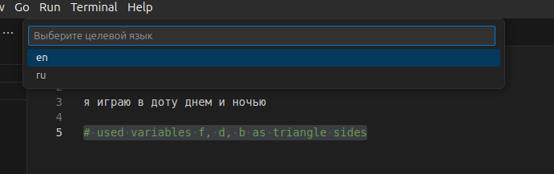
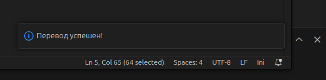
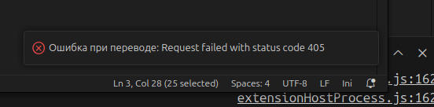
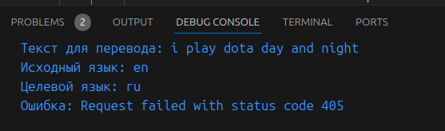

# **Translater for A2 students** README

This extension is designed for convenient text translation as an assistant to an unfortunate student with A2 ＼(◎o◎)／

## Work process

1. Highlighting a line of code requiring translation
2. Initializing the extension by shortcut `ctrl+shift+/`
3. Select the language into which you want to translate the text in the pop-up window:
 

4. A message about the successful completion of the translation and changing the text to an identical one in the desired language

4. If there is an error, it will be displayed in a pop-up window. The text to be translated, the source target language and the error text will appear in DebugConsole
   

## Features
### translateCommand

- ** Team system name:** `translate-this-text->_<`
- ** Callsign:**  `Translate Selected Text`
- **Requires:** active editor
- **Receives input:** selection of text in the editor
- ** Team work:**
1. Get the text from the selection and remove unnecessary spaces. If the text is not highlighted, a message is displayed and execution ends.
2. The user is asked to select the target language to be translated. This is done with  `showQuickPick`
3. The source language is determined based on the selected target language. If the target was English, then the original target is Russian, and vice versa.
4. Inside the  `try` block, we send a `get request to the MyMemory API`.
    The request includes:
    - `q`: the text to be translated.
    - `langpair`: a combination of source and target languages.
5. Getting a response from the API and extracting the desired text.
6. Change the selected text in the editor to the translated text.
- **Upon completion of the transfer:**
            - If the transfer is successful, a success notification is displayed.
            - If an error occurs, it is processed in the `catch` block. The error message is displayed in the console and displayed to the user.

- **Пример работы:**
Input line: *Hi, I am a student at ITMO University*
Output line: *Привет, я студент Университета ИТМО*

### 1.0.0

Initial release of ...

## Author
Акулиничева Мария Андреевна, M3100 # itmo-ISRPO
